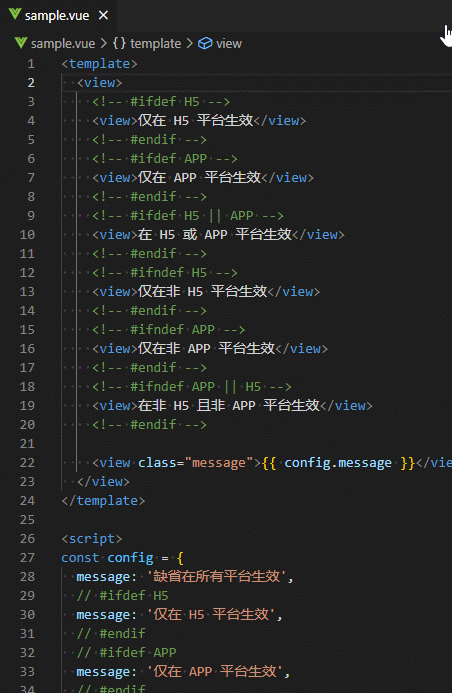

# 项目说明

uni-app 在 Vue 的语法基础上支持了条件编译，对于处理多端发布的差异性非常方便。
但是当代码中有很多条件编译的代码块时，阅读起来并不容易。

本项目使用 VS Code 插件来帮助开发者阅读和理解条件编译的代码块。

在代码编辑窗口里，当输入光标处在一个条件块范围内时，插件会自动扫描代码中的所有条件块，
把互斥的条件块代码做变灰处理，使得在相同目标平台生效的代码能突显出来，便于理解各端的代码逻辑。

# 参考资料

[VS Code API](https://code.visualstudio.com/api/references/vscode-api)

[uni-app 条件编译](https://uniapp.dcloud.net.cn/tutorial/platform.html)
